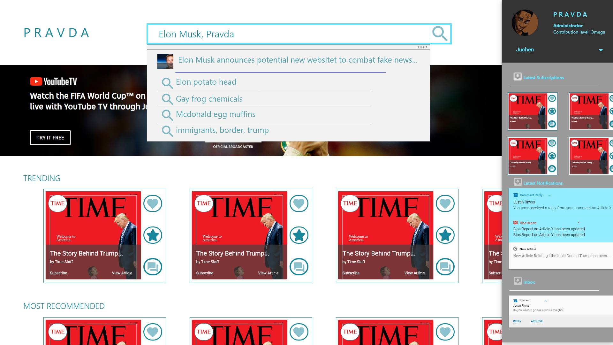

# Pravda

Crowdsourced Fake News Detecting Website in Progress

### Functionality

- Allows Individuals to search Up News Articles based off title, url link, or keywords
- Arranges news articles based off writer, and the news publication/wesbite 
- Allows users to critique such articles, give their opinions, and determine what is factual, what is not, and what is opinion
- Articles, Authors, and News organization are ranked based on credibility, and biased based of User's rating
- Individuals reading articles of a select bias are recommended articles of the opposite bias to help counter polarization
- Allow Individuals to install a plugin that allows them to see all user critiques of an article as they browse through

### Progress

Initial Adobe XD Design: https://xd.adobe.com/view/3bd98325-20f0-49e8-76b7-d4d30aaf7df5-4de8/?fbclid=IwAR0Ofb3kiEXpFwt4vXcYOTkjVdGjDl1ECCHzjib77eeD8ijNwARTbzkGt-4&fullscreen

######Future Plans

- [ ] Create basic web crawler function
- [x] Set up serverless API and data base(basic user functionalities, signup,login, comment on article etc.)
- [x] Format FrontEnd Pages 
- [x] Extend user functionalities (search database, highlight article to comment on specific portions, upvate user comments etc.)
- [x] Deploy client on netlify and backend API on AWS/Seed
- [ ] Look into using Redis as a cache
- [ ] Make any neccessary changes/improvements
- [ ] Create Browser extension/add-on version
- [ ] Improve web-crawling
